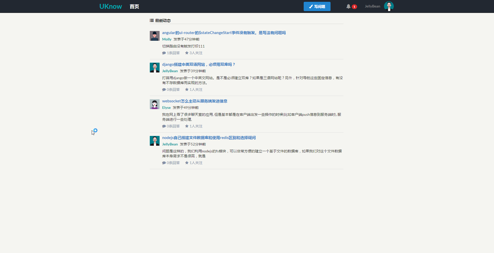
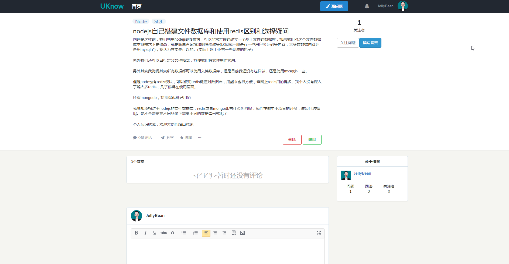
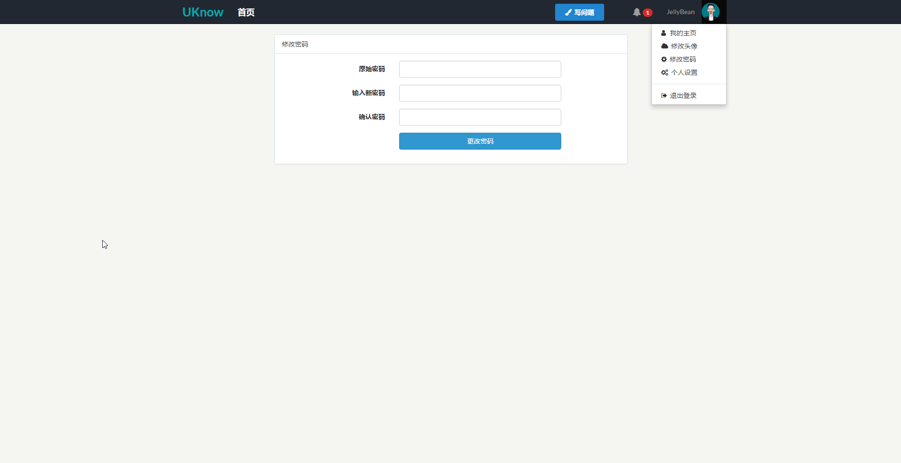
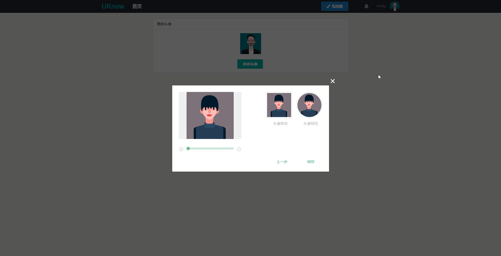
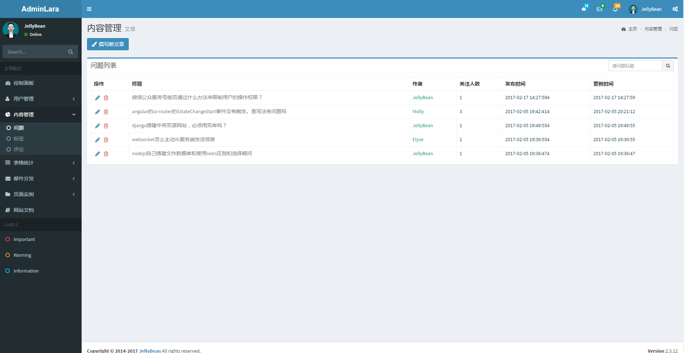
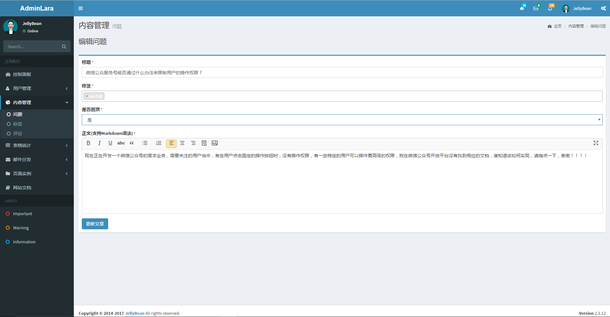

## Laravel-Zhihu
基于**Laravel5.3** 开发

## 前言
基于 [laravist](https://www.laravist.com/)社区知乎系列项目
后台模板采用 [AdminLTE-For_Laravel](https://github.com/GeekGhc/adminLTE-for-laravel)

## 功能

### 用户
- [x] 登录注册(邮件认证)
- [x] 用户设置
- [x] 头像上传至七牛云存储
- [x] 修改密码
- [x] 忘记密码(邮件认证)
- [x] 用户相互关注(邮件提醒)
- [x] 用户发送私信(消息通知)
- [x] 显示私信(已读和未读)
- [x] 标志私信
- [x] 标志私信全部已读
- [x] 回复私信
- [x] 个人主页(各项数据)

### 问题
- [x] 问题列表
- [x] 收藏问题(消息通知)
- [x] 分享问题到第三方
- [x] 问题答案评论(消息通知)
- [x] 问题评论,答案评论(消息通知)
- [x] 答案点赞
- [x] 发布问题
- [x] 修改问题(仅限问题的作者)
- [x] 删除问题(仅限问题的作者)

### 后台
- [x] 系统用户
- [x] 系统用户资料修改,删除
- [x] 管理员资料修改
- [x] 创建问题(可置顶)
- [x] 编辑问题(对任何用户的问题)
- [x] 删除问题(对任何用户的问题)
- [x] 问题评论
- [x] 删除问题评论(对任何用户的评论)
- [x] 文章标签
- [x] 删除文章标签

## 效果预览
### 前台部分

### 后台部分

## 安装

> 前台部分为1.0版本 前后台为2.0版本

### 1.克隆源码到本地
> git clone https://github.com/GeekGhc/zhihu-app

### 2.进入项目目录
> cd zhihu-app

### 3. 拷贝`.env`文件
一些 `secret key` 改成自己服务的`key`即可
> cp .env.example .env

### 4. 下载相关的依赖包(也可以使用yarn)
下载`laravel`相关依赖的包
> composer install

### 5. 创建数据
> php artisan zhihu:install

### 6.管理员创建
> php artisan create:admin

填写完指令要求信息后 管理员创建成功